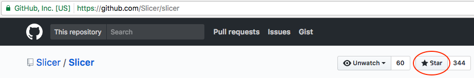

SlicerDMRI is an open-source project to improve and extend diffusion magnetic resonance imaging software in 3D Slicer.

Help!
-----

After reviewing the material below, for usage questions please visit the [Slicer Discussion Forum](https://discourse.slicer.org).

General Slicer guide
---------------------
* [Slicer training](http://www.slicer.org/slicerWiki/index.php/Documentation/Nightly/Training)

Tutorials and sample data
---------------------
* [DWIConverter tutorial](http://dmri.slicer.org/tutorials/dwi_converter) ([test data](https://github.com/Slicer/slicer.kitware.com-midas3-archive/releases/download/SHA256/717d68b4aee11b8ffba5dd5409ab87a658d9fbef3061a7dcd1088c0bf14a7473)): diffusion weighted image data conversion from DICOM to NRRD
* [Slicer DTI tutorial](http://dmri.slicer.org/tutorials/diffusion_mri_analysis): General DTI overview
* [Slicer Neurosurgical Planning tutorial](http://dmri.slicer.org/tutorials/neurosurgical_planning_dti): Interactive DTI tractography in Slicer
* [Slicer UKF Tractography tutorial](http://dmri.slicer.org/tutorials/ukf_tractography): Multi-fiber tractography for crossing fibers
* [Slicer Fiber Bundle Selection and Scalar Measurements tutorial](http://dmri.slicer.org/tutorials/tractography_measurement): Tractography selection and measurements for studies
* [Slicer CLI Application tutorial](http://dmri.slicer.org/tutorials/cli_measurements): Tractography selection and measurements in command line interface (CLI) mode
* [DICOM TR Converter tutorial](http://dmri.slicer.org/tutorials/dicom_tractography): Loading and saving tractography as DICOM TR objects.

*Note*: the linked test data is an NRRD file containing a diffusion-weighted MRI volume. You will need to set a file
suffix (i.e. `.nrrd`) to load it into Slicer.

Individual Slicer module documentation pages
---------------------
* [Slicer nightly documentation of Diffusion MRI modules](http://www.slicer.org/slicerWiki/index.php/Documentation/Nightly#Modules_by_category_Diffusion)

For developers
---------------------
* [Source code of SlicerDMRI and whitematteranalysis](https://github.com/SlicerDMRI)
* [DICOM Tractography Connectathon at RSNA 2017](https://qiicr.gitbooks.io/dicom4qi/content/instructions/tractography-results-dicom-tr.html)
* [Python code to access tensor data from a DTI volume](https://www.slicer.org/slicerWiki/index.php/Documentation/Nightly/ScriptRepository#Access_values_in_a_DTI_tensor_volume)

* Please consider adding a "star" to these GitHub repositories:
    * [http://github.com/SlicerDMRI/SlicerDMRI](http://github.com/SlicerDMRI/SlicerDMRI)
    * [http://github.com/Slicer/slicer](http://github.com/slicer/slicer)
    

Acknowledgments
---------------

The [SlicerDMRI developers](https://github.com/orgs/SlicerDMRI/people)
gratefully acknowledge funding for this project provided by NIH NCI ITCR U01CA199459 (Open Source Diffusion MRI Technology For Brain Cancer Research), NIH P41EB015898 (National Center for Image-Guided Therapy) and NIH P41EB015902 (Neuroimaging Analysis Center), as well as the National Alliance for Medical Image Computing (NA-MIC), funded by the National Institutes of Health through the NIH Roadmap for Medical Research, Grant U54 EB005149.

