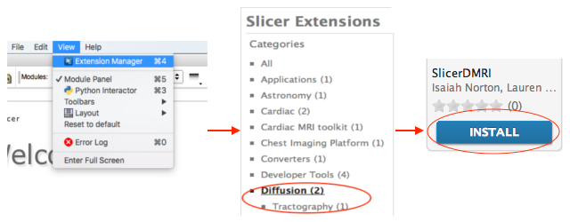

SlicerDMRI is a [3D Slicer](http://www.slicer.org) extension.

First, [download and install 3D Slicer](http://download.slicer.org/) for your platform (Mac, Windows, or Linux). 

Then, install the SlicerDMRI extension using the Slicer extension manager. *Please make sure to restart Slicer after installing the extension!*. 

The source code for Slicer and SlicerDMRI is available from GitHub:

  - https://github.com/SlicerDMRI/SlicerDMRI
  - https://github.com/Slicer/slicer

Full documentation for the Extension Manager is available [here](https://www.slicer.org/wiki/Documentation/Nightly/SlicerApplication/ExtensionsManager).

For any questions, please contact us on the [Slicer Discussion Forum](https://discourse.slicer.org/c/community/slicerdmri), or file an issue on GitHub.
